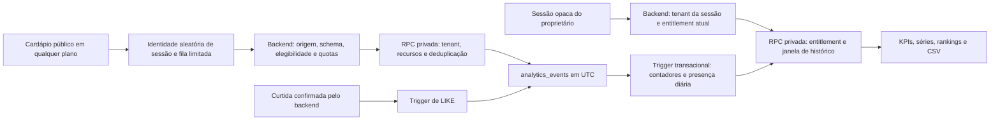

# Fase 3 — Analytics do cardápio

Implementação local em 02/10/2026. Depende das migrations e contratos das [Fases 1](./19-OWNER-PHASE1-FOUNDATION.md) e [2](./20-OWNER-PHASE2-COMMERCIAL-UI.md). Esta fase implementa coleta e relatórios reais do cardápio público. A criação de códigos QR permanece para uma fase futura. Não houve aplicação destas migrations nem teste com dados reais de produção durante a implementação.

## 1. Fluxo e limites da interpretação



As métricas descrevem interações observadas, não faturamento, pedidos, pessoas identificadas nem atribuição comprovada de vendas. Eventos de navegador podem ser bloqueados ou falsificados. Schema, origem, validação dos recursos, deduplicação e quotas reduzem erros e abuso; não são prova criptográfica de que alguém assistiu a um vídeo. Curtidas têm confirmação transacional própria.

Não existem métricas reconstruídas antes da data de implantação. Os rankings de curtidas usam novas curtidas confirmadas no período; o contador vitalício antigo do produto continua independente. Dados ilustrativos permanecem apenas na demonstração bloqueada da Fase 2 e nas fixtures de testes.

## 2. Identidade e privacidade

- `crypto.randomUUID()` cria a identificação aleatória guardada em `sessionStorage.pc_analytics_session`. Recarregar conserva a identidade; fechar a sessão normalmente a encerra. Outra aba/dispositivo pode receber outra identidade; uma aba duplicada ou aberta a partir de outra pode herdar o conteúdo do sessionStorage. Limpeza de armazenamento e navegação privada também afetam a contagem.
- Quando sessionStorage não está disponível, a identidade fica somente na memória da página. O número de visitantes pode subir entre recargas nesse caso.
- O servidor guarda somente HMAC SHA-256 da identidade com domínio próprio e business ID. O mesmo identificador em dois estabelecimentos produz hashes diferentes. Não existe fingerprinting, junção com conta do consumidor ou tabela de pessoas.
- Visitantes são identidades anônimas de sessão distintas que emitiram `MENU_VIEW` no intervalo. Uma identidade com cinco visualizações representa cinco visualizações e um visitante. Não se somam visitantes únicos diários para obter visitantes únicos mensais.
- Para quotas, o IP recebido pelo servidor é transformado em HMAC com data UTC e domínio de segurança. O endereço bruto não entra nas tabelas analíticas, nos metadados dos eventos ou nas respostas. O contador de abuso é global por hash de IP/minuto e por identidade do tenant/minuto. O rate limiter HTTP também mantém seu estado temporário em memória. Logs e infraestrutura externos continuam sujeitos às configurações próprias do projeto.
- `ANALYTICS_HASH_SECRET`, com ao menos 32 caracteres aleatórios, permite separar a chave analítica. Quando vazio, usa-se HMAC com separação de domínio sobre `OWNER_SESSION_ENCRYPTION_KEY`. Nenhuma chave vai ao frontend. Rotacionar a chave rompe a continuidade entre identidades antigas e novas; planejar a rotação e a interpretação dos relatórios.
- O navegador envia apenas IDs aleatórios, evento, recurso e classificação de origem. Não envia timestamp escolhido pelo visitante, IP, e-mail, conta, user agent, localização, referrer completo, URL ou metadados arbitrários. O backend usa horário UTC de recebimento e metadados de vídeo com somente `mediaId` e `playId`.
- Origem é um bucket: `direct`, `qr`, `instagram`, `facebook`, `google`, `whatsapp` ou `other`. `unattributed` é reservado para as curtidas confirmadas. A classificação aceita `source`/`utm_source` conhecidos; caso contrário usa somente o domínio de referência. Nunca persiste esse domínio ou a URL original.
- DNT e GPC suspendem a coleta de navegador. Headers equivalentes e user agents de bots conhecidos são ignorados na API. A curtida explicitamente confirmada continua incrementando o contador e seu evento do servidor, sem visitante/origem atribuídos. Serviços de vídeo Mux e sua telemetria existente continuam separados deste armazenamento.
- A presença diária conserva hashes de sessão para deduplicação exata entre dias e buckets. Portanto, essa tabela tem dados pseudonimizados, não apenas somas irreversíveis. Seu acesso é privado, sua retenção acompanha a política configurável de agregados e ela nunca é exportada. Diminuir a retenção também reduz o histórico disponível para visitantes únicos.
- A exclusão definitiva do estabelecimento remove eventos, agregados, presença e referências QR por FK com cascade. Não há dados de outra empresa nas respostas do proprietário.

## 3. Semântica dos eventos

| Evento | Quando ocorre | Deduplicação e significado |
|---|---|---|
| `MENU_VIEW` | Carregamento bem sucedido de um cardápio publicado | Uma vez por navegação/page ID, incluindo a tela de boas-vindas; não depende de entrar no catálogo. Recarga/nova navegação é outra visualização. |
| `CATEGORY_VIEW` | Seleção explícita de uma categoria ativa | Uma por categoria por navegação. A renderização inicial da lista e o filtro “Todas” não contam. |
| `PRODUCT_VIEW` | Abertura do modal/detalhe do produto disponível | Uma por produto por navegação, mesmo se o modal for reaberto. Ver um cartão na lista não conta. |
| `LIKE` | Inserção efetiva de uma nova curtida no ledger `anonymous_likes` | Trigger do banco, na mesma transação da curtida. Repetição da curtida não insere outro evento. A API de eventos do navegador rejeita LIKE. Sem origem, QR ou visitante analítico atribuídos. |
| `VIDEO_PLAY` | Evento `playing` real do Mux Player após início explícito | Uma por play ID. Clique que falha, solicitação de token, pausa/continuação e re-render não contam como nova reprodução. Nova abertura de reprodução recebe novo play ID. |
| `VIDEO_25` | Cobertura assistida chega a 25% da duração | Uma por play ID. Soma dos intervalos únicos em `player.media.played` (API da versão Mux Player 3 instalada), não posição atual. |
| `VIDEO_50` | Cobertura assistida chega a 50% | Mesmo critério de cobertura. Avançar a posição não conta como assistir o trecho pulado. |
| `VIDEO_100` | `ended` com pelo menos 95% de cobertura assistida | Uma conclusão por play ID. Tolerância para bordas de reprodução. Encerrar após pular quase tudo não conta. |
| `QR_ENTRY` | Nova navegação com origem declarada `qr` | Uma por navegação. Não prova leitura física do código. QR sem ID registrado fica no grupo não identificado. |

Preview do editor, do telefone no dashboard, playback do proprietário e demonstrações não iniciam uma página analítica. Os hooks verificam preview e slug ativo. O `pageId` permanece estável durante as renderizações do Angular; o fluxo da rota pública usa `switchMap` e é encerrado ao sair da página.

### Entrega e deduplicação

A fila de navegador comporta até 100 eventos; envia lotes de no máximo 20 após 700 ms. O conjunto de recursos observados é limitado a 1.000 entradas por navegação. Não são filas persistentes de dados pessoais. Uma falha de rede/5xx permite uma única repetição com os mesmos IDs; recusa/rate limit não causa repetição automática. Após 429, a coleta dessa instância recua por um minuto.

`visibilitychange`/`pagehide` tentam descarregar a fila com `fetch` keepalive. Os envios HTTP e keepalive usam `credentials: omit`, sem tokens/cookie de proprietário/CSRF. Keepalive não garante entrega se o navegador encerrar abruptamente.

O banco impõe tanto unicidade `(business_id,id)` quanto `(business_id,dedupe_key)`. A chave semântica inclui identidade hash, página, evento, item/categoria e play ID quando aplicável. IDs novos para o mesmo evento semântico também são deduplicados. A garantia cobre o período em que o raw existe; não se oferece deduplicação eterna de payloads reapresentados após a retenção. A fila reutiliza IDs nos retries normais de curta duração.

## 4. Modelo SQL

Migration: `supabase/migrations/20261003030000_menu_analytics.sql`.

| Estrutura | Conteúdo e finalidade |
|---|---|
| `analytics_settings` | Singleton privado de timezone, retenção e histórico dos planos, com checks de coerência. Timestamp de início da coleta. |
| `analytics_events` | Business, UUID do evento, hash opcional do visitante, UUID de página, nome, item/categoria, bucket de origem, QR opcional, `timestamptz` UTC, metadados controlados e chave de dedupe. |
| `analytics_daily` | Contadores por business/dia/evento/origem/QR. |
| `analytics_hourly` | Contadores com hora local, necessários para séries de um dia e distribuição de horários. |
| `analytics_dimensions_daily` | Contadores por produto/categoria/dia/evento/origem/QR, para rankings e tendências. |
| `analytics_visitors_daily` | Presença de cada identidade por dia/origem/QR e máscara de 24 horas. Permite `count(distinct visitor_id)` exato no intervalo e na hora. |
| `analytics_ingest_quotas` | Contagem persistente por hash/minuto. Funciona entre instâncias, com ordem de lock consistente. |
| `analytics_qr_refs` | Cadastro mínimo privado de referências QR: ID, business, label e ativo. Reserva a integração da próxima fase; não cria imagens, links ou códigos. |

Chaves primárias dos agregados começam em business e dia. Agregados e presença também possuem índices por dia para limpeza global. Raw possui índices por timestamp global, para retenção, e business/timestamp, para diagnóstico isolado. Rankings têm ordem estável por valor decrescente e ID, offset/limit no banco e total de posições. Recursos históricos não possuem FK de item/categoria/QR no raw que apague suas contagens ao remover o conteúdo; consultas mantêm a identificação interna e usam rótulo de recurso removido sem buscar nomes de outro tenant.

Todas as tabelas têm RLS forçada e grants de browser revogados. Não há política pública de leitura/escrita. RPCs de ingestão, consulta e manutenção são acessíveis somente à service role. Funções privadas têm `search_path` vazio. Service role pertence ao BFF e não pode ser entregue ao navegador.

### Agregação e performance

Trigger `AFTER INSERT` atualiza os contadores e presença de forma síncrona e transacional. Se a gravação falha, não se confirma um evento sem seus agregados. Uma duplicata não executa o trigger. A primeira curtida registrada executa seu próprio trigger para entrar no mesmo fluxo.

Os endpoints de relatórios consultam apenas agregados e presença; não carregam raw events. A série preenche zeros no banco. A presença é necessária para unicidade exata e o custo cresce com identidades/dias observados, não é um contador constante. Isso deve ser considerado no dimensionamento: tráfego muito grande requer medir planos de execução, índices e custo do DISTINCT; os testes atuais verificam correção, não um benchmark de milhões de identidades. Contadores compactos tornam as demais métricas proporcionais aos buckets de agregação. Não foi adicionada extensão de contagem aproximada.

O BFF tem cache de resultados por 10 segundos, com no máximo 256 entradas por processo e 64 KiB de payload por entrada. Resultados maiores não entram no cache. A chave inclui tenant, todos os parâmetros, entitlements e configurações. Verifica sessão/estado de conta e entitlement atual antes de atender resultados em cache. Downgrade não herda acesso por cache. O cache não é distribuído, e dados podem atrasar até dez segundos. Respostas HTTP são `private, no-store`; não usar CDN pública para Analytics. Agregados são produzidos no banco; o frontend somente representa as séries recebidas.

## 5. Retenção e timezone

| Configuração de `analytics_settings` | Default |
|---|---:|
| `timezone` | `America/Sao_Paulo` |
| `raw_retention_days` | 90 |
| `aggregate_retention_days` | 3.650 |
| `basic_history_days` | 31 |
| `advanced_history_days` | 730 |
| `complete_history_days` | 3.650 |

Timezone é global e definido no banco para a plataforma nesta fase, não uma escolha mutável do visitante. Datas de filtro são calendário desse timezone; raw é UTC e usa o relógio do servidor. Horário de recebimento determina a data; um evento recebido após meia-noite pode pertencer ao dia seguinte. Não aceitar timestamps passados enviados pelo consumidor.

Trocar timezone após existir agregado é bloqueado para não reinterpretar contadores históricos. Uma troca exige migração/backfill explícito; depois de expirado o raw não é possível reconstruir toda a granularidade anterior. Nenhuma troca automática foi implementada. Limites e calendário são conferidos novamente na RPC com o relógio do banco.

Configuração usa acesso operacional privado. Exemplo de uma política coerente de dois anos para todas as janelas ampliadas, **a aplicar somente após decidir a política de retenção do ambiente**:

```sql
UPDATE public.analytics_settings
SET raw_retention_days = 90,
    aggregate_retention_days = 730,
    basic_history_days = 31,
    advanced_history_days = 730,
    complete_history_days = 730
WHERE singleton = true;
```

Diminuir retenção e executar manutenção remove dados de forma definitiva. Aumentar histórico não restaura dados já eliminados. Cache de configurações dura dez segundos; o banco sempre utiliza a configuração atual para autorizar o intervalo.

Agendar diariamente, usando o mecanismo de jobs do ambiente, `POST /api/v1/internal/operations/analytics/maintain` com o Bearer secreto de jobs existente. A operação executa `maintain_menu_analytics()`: remove raw além da janela, quotas anteriores a dois dias e contadores/presença fora da retenção longa. Deletar raw não subtrai seus agregados. A implementação entrega o endpoint e a RPC; **o agendamento externo precisa ser configurado no ambiente de implantação**. Sem executar o job a retenção física não ocorre. Esta tarefa não alterou schedulers remotos.

## 6. Entitlements e visualização

| Plano | Flags necessárias | UI e APIs | Histórico inicial |
|---|---|---|---:|
| Free | Nenhuma flag analítica | Coleta pública ativa. Dashboard exibe preview sem chamar endpoint real. GET analítico manual retorna 403. | Sem leitura |
| Basic | `ANALYTICS_BASIC` | Menu views, sessões únicas, product views, plays, série e produtos vistos/curtidos; filtros úteis dentro da janela. | 31 dias |
| Medium | Basic + `ANALYTICS_ADVANCED` | Filtros completos, comparação anterior, categorias, horários, origens, tráfego QR agregado, tendências. | 730 dias |
| Pro | Basic + Advanced + `ANALYTICS_EXPORT` | CSV, comparação de ano anterior/customizada e detalhe/filtro por referência QR registrada. | 3.650 dias |

A coleta não depende do plano; depende do cardápio ativo, publicado e comercialmente elegível. As permissões de visualização vêm do snapshot real do backend. Contratação e cobrança de planos pagos continuam fora desta fase; flags atribuídas pelos fluxos administrativos existentes permitem uso conforme a matriz real.

Backend vincula business à sessão opaca e não aceita `businessId` em query/body analítico. A RPC também verifica entitlements e estado de conta. IDs de produto e QR em filtros precisam pertencer ao mesmo tenant. Basic não desbloqueia origem, categorias, comparação ou QR pela URL. Medium não desbloqueia exportação, comparações premium ou QR individual. Expansão indevida do histórico retorna 400.

O resumo Basic contém somente `menuViews`, `visitors`, `productViews`, `videoPlays` e `likes`. Total de entradas QR e marcos de consumo dos vídeos são omitidos no SQL e na resposta HTTP do Basic; ocultar esses campos apenas na interface não seria um gate suficiente.

Curtidas são deliberadamente sem atribuição: ao filtrar por origem/QR, não interpretar ausência de curtidas como desengajamento desses acessos. A UI informa que é necessário remover esses filtros para ver as curtidas do período. O CSV registra essa definição.

## 7. Filtros e comparações

Presets completos no Medium/Pro: Hoje, Ontem, Últimos 7 dias, Últimos 30 dias, Este mês, Mês anterior, Últimos 3 meses, Últimos 6 meses, Este ano e Ano anterior. Também dia, mês, ano específico e intervalo personalizado. Basic oferece hoje/ontem/7/30/este mês/dia/customizado dentro dos 31 dias. Mês/ano atual selecionado especificamente termina em hoje; o futuro é recusado.

Últimos 7/30 dias incluem hoje. Últimos 3/6 meses são janelas de calendário móveis, incluindo hoje e iniciando no dia seguinte à data de três/seis meses atrás, com ajuste para a quantidade de dias no mês. Mês anterior/ano anterior são períodos completos de calendário.

`previous` usa o intervalo imediatamente anterior com o mesmo número de dias inclusivos. Exemplo: 01/09–30/09 versus 02/08–31/08, trinta dias em ambos. É uma comparação de igual duração; para comparar meses de calendário com tamanhos diferentes o Pro aceita intervalo personalizado. `year` retrocede um ano nas duas datas e ajusta 29 de fevereiro para 28 quando necessário. `custom` aceita datas distintas; a UI informa ambas as durações. A janela comparada também precisa caber no histórico.

Para cada KPI: atual, anterior, diferença absoluta e `((atual-anterior)/anterior)*100`, arredondado a uma casa. Anterior zero produz `percent: null` e “Sem base percentual”; nunca infinito, 100% artificial ou divisão por zero.

Granularidade principal: um dia = 24 horas; 2–60 dias = dia; 61–180 dias = semana; mais de 180 dias = mês. Semanas são de calendário, e o primeiro bucket é cortado pelo início selecionado. Ano completo é mensal. Tendências de produto usam agregados dimensionais diários, com buckets dia/semana/mês e zeros; em um único dia, a tendência do produto exibe um total diário. Distribuição horária e série horária geral continuam disponíveis.

## 8. Endpoints

Prefixo `/api/v1`.

| Método e caminho | Autorização e uso |
|---|---|
| `POST /public/menu/:slug/events` | Anônimo; Origin explícito permitido, menu elegível, strict schema e quotas. 202 com `accepted`; 400 inválido, 403 origem, 404 indisponível, 413 body excedido, 415 tipo de conteúdo e 429 quota. Sem tokens do proprietário. |
| `GET /analytics/options` | Basic+. Timezone, hoje/minDate, histórico, início da coleta, retenções e capacidades. Sem query. |
| `GET /analytics` | Basic+. Summary, série, rankings iniciais de cinco posições, comparação opcional e blocos adicionais permitidos. |
| `GET /analytics/rankings` | Basic para produtos/likes/plays; Advanced para categorias. `metric`, `page`, `pageSize`, filtros. Paginação no servidor. |
| `GET /analytics/product-trends` | Advanced. `itemId` do tenant e filtros. Retorna série pronta. |
| `GET /analytics/qr` | Export/Pro. Referências com entradas agregadas; nenhum gerador. |
| `GET /analytics/export.csv` | Export/Pro. `section=series\|products\|likes\|categories\|sources\|qr`. Mesmo tenant/período/filtros, no máximo 5.000 posições de ranking; excesso retorna 413. |
| `POST /internal/operations/analytics/maintain` | Credencial de jobs existente. Limpeza configurável privada. |

Consultas têm schema fechado. Parâmetros comuns: `start`, `end` em `YYYY-MM-DD`, `comparison=none|previous|year|custom`, `comparisonStart`, `comparisonEnd` somente com custom, `source` do enum e `qrId` registrado. Rankings: `metric=product_views|likes|video_plays|categories`, `page` e `pageSize` até 50. Parâmetros desconhecidos e relações incompatíveis são recusados. Default é últimos sete dias, sem comparação.

Payload de coleta:

```json
{
  "visitorId": "11111111-1111-4111-8111-111111111111",
  "pageId": "22222222-2222-4222-8222-222222222222",
  "source": "direct",
  "events": [{ "id": "33333333-3333-4333-8333-333333333333", "eventName": "MENU_VIEW" }]
}
```

Categoria recebe somente `categoryId`; produto recebe `itemId`; vídeo recebe `itemId`, `mediaId` e `playId`. Recursos são validados no banco, incluindo disponibilidade, categoria ativa, vídeo pronto/publicado e pertencimento ao tenant. Um QR opcional no batch só é aceito com source QR e referência ativa do tenant. Para links externos genéricos usar `?source=qr`, sem inventar IDs registrados.

Quotas: body JSON de 16 KiB, 20 eventos/batch, 60 requests/IP/minuto na coleta, 90 requests/IP/minuto nas consultas autenticadas, além dos limites globais existentes. Defaults persistentes: 1.500 eventos/IP/minuto e 180 eventos/identidade do tenant/minuto, ajustáveis por `ANALYTICS_IP_EVENTS_PER_MINUTE` e `ANALYTICS_SESSION_EVENTS_PER_MINUTE` nos limites validados. Duplicatas e batches recusados por quota consomem orçamento; transações abortadas por erro de recurso não mantêm o incremento SQL. O limite HTTP também protege essas tentativas inválidas. Origin é uma restrição de navegador, não uma credencial secreta; um cliente programático pode imitá-lo e ainda estará sujeito às demais validações/quotas.

`ANALYTICS_COLLECTION_ENABLED=false` é pausa emergencial dos lotes públicos; curtidas confirmadas continuam sendo registradas. Modo demo não inventa dados persistidos: coleta retorna explicitamente disabled, e os entitlements demonstrativos Free bloqueiam leitura real.

CSV é UTF-8 com BOM, campos entre aspas, aspas internas duplicadas e neutralização de fórmulas iniciadas por `=`, `+`, `-`, `@` ou whitespace de controle relevante. Contém metadados do período/timezone/filtros, definições e contagens/nomes. Não inclui UUIDs internos, hashes de visitante/IP, eventos individuais, tokens, e-mails ou URLs. A seção escolhida exporta o intervalo atual; comparação no painel não muda o significado dos dados exportados. Rankings não são truncados silenciosamente acima de 5.000 posições.

## 9. Componentes e UX

- `PublicAnalyticsService`: sessão aleatória, página estável, classificação de origem, dedupe, fila limitada e keepalive. `PublicMenuComponent` inicia a página somente após sucesso do carregamento; `PublicMenuViewComponent` emite seleção de categoria e abertura de detalhe.
- `ProductMediaGalleryComponent`: hooks de `playing`, `timeupdate` e `ended` do Mux; identifica reprodução e cobertura assistida. Não altera assinatura, token ou controles existentes de playback.
- `AnalyticsService`: contratos tipados para reports/rankings/trends/CSV. Usa a sessão BFF e o interceptor existente; nenhum business ID vem do cliente.
- `AnalyticsComponent`: opções por entitlement, presets, calendário, comparação, quatro KPIs, blocos advanced, rankings e exportação. Estado assíncrono com signals e cancelamento de consulta por `switchMap`; novas aplicações de filtros cancelam report, ranking, trend e CSV anteriores. Seleções rápidas passam por debounce de 160 ms. O tenant/plano do browser não autoriza o backend.
- `AnalyticsChartComponent`: SVG 2D de uma métrica por vez, escala simples e uma cor de dados. Tabela acessível com cada valor, rótulos de período e estado vazio. Formatação pt-BR registrada. Nenhuma soma de eventos brutos no frontend.
- `DashboardComponent`: usa componente real somente quando o entitlement permite. Free mantém `FeaturePreviewComponent`, sem montar Analytics ou chamar APIs reais. QR permanece na demonstração.
- Painel mantém fontes, tokens do tema claro/escuro, superfícies clay, foco visível, tooltips acessíveis por hover/foco, estados de carregamento/erro/vazio e reduced motion. Layout adaptável de KPIs/rankings, sem gráficos 3D. Texto de configurações/termos/privacidade foi atualizado para o estado implementado.

## 10. Validação e implantação

Comandos:

```powershell
cd backend
npm test -- --runInBand
npm run build
npm run test:database

cd ../frontend
npm test -- --watch=false
npx --no-install tsc --noEmit -p tsconfig.app.json
npm run build
npm run security:scan
npm run e2e -- e2e/menu-analytics.spec.ts e2e/owner-phase2.spec.ts
```

Testes específicos:

1. Backend HTTP: Free/Basic/Medium/Pro, parâmetros proibidos, contexto do tenant, cache separado/downgrade, CSV/fórmulas, datas impossíveis/invertidas/futuras, timezone/leap year, comparação com zero, origem, schema, body/lote excessivo, DNT/GPC/bot e quotas.
2. PostgreSQL 16 local temporário: aplica toda a cadeia de migrations; 24 verificações da fundação e 14 de Analytics. Coleta Free, dedupe concorrente, tiers/histórico, recursos cruzados ou indisponíveis, UTC/calendário e distinct entre dias/horas, categorias/origens/tendência zero-fill, Mux publicado, LIKE transacional, Pro QR, tenant A/B, quotas concorrentes, paginação/removidos, grants/RLS/RPC privados, retenção e guarda de timezone. Não usa `.env` nem URL remota; remove os dados temporários ao terminar.
3. Frontend: fila/identity/dedupe/retries, ausência de credenciais/PII, QR sem generator, sinais de privacidade, início real de vídeo, avanço para o fim e exclusão do preview.
4. Playwright desktop/mobile com API simulada: capabilities dos quatro planos, preview Free sem chamadas analíticas, tabelas/tooltips, paginação, presets/datas, filtros de origem, tendência fornecida pelo servidor, QR registrado, CSV, sessão pública entre recargas e regressões da jornada da Fase 2. Não representa um teste remoto de Supabase/Mux real.

### Resultados obtidos

| Verificação | Resultado |
|---|---|
| Jest backend | 130 testes passaram em 14 suites; uma integração remota continuou desabilitada, sem credenciais reais. |
| Vitest frontend | 42 testes passaram em 11 arquivos. |
| PostgreSQL temporário | Cadeia completa de migrations e 38 verificações passaram: 24 da fundação e 14 de Analytics. |
| Playwright | 38 casos passaram em desktop/mobile; os dois casos Pro foram reexecutados após o ajuste final de layout/tema e também passaram. |
| Typecheck e builds | Backend TypeScript e frontend TypeScript/Angular passaram. Bundle inicial: 457,13 kB. |
| Scanner de segredos | Passou nos 19 arquivos textuais do build frontend. |
| Diff | Sem erros de whitespace, considerando os finais CRLF do workspace Windows. |

O build mantém os avisos já existentes de CSS no editor de design (27,63 kB) e no cardápio público (38,98 kB), acima do budget de aviso de 25 kB. Não foram ampliados budgets para ocultar avisos. A validação de banco foi real e local; Playwright usou API simulada, e não houve reprodução de mídia real hospedada no Mux durante os testes.

A migration foi validada localmente. Para disponibilizar em um ambiente: aplicar as migrations anteriores e esta em ordem, manter os segredos no backend, conferir Origin/proxy/relógio do ambiente, definir a política de retenção e agendar manutenção. A tarefa não realizou deploy, escrita em banco remoto, contratação de Mux, publicação de dados ou geração de QR. Próximas fases não foram implementadas.
