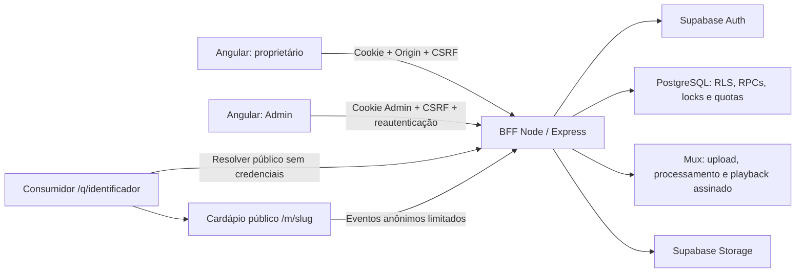

# Fase 4 — QR Code, Analytics e revisão final de segurança

Relatório do código e das verificações locais de 02/10/2026. Consolida as fases 1–4 do proprietário e os limites da validação. As migrations, variáveis e tarefas descritas aqui **não foram aplicadas ou configuradas no Supabase/Vercel de produção nesta execução**.

## 1. Arquitetura final

O produto mantém três experiências: proprietário em `/dashboard`, administração interna em `/admin/...` e consumidor em `/m/:slug`. O estabelecimento é o tenant; uma identidade proprietária tem um business e um cardápio. Constraints e referências compostas no PostgreSQL reforçam essa relação.

Angular apresenta os dados e solicita operações ao BFF Express/TypeScript em `/api/v1`, pela mesma origem do navegador. Supabase Auth valida identidades; PostgreSQL concentra sessões, assinaturas, entitlements, limites transacionais, quotas, Analytics e QR. Supabase Storage atende mídias existentes; Mux processa vídeos e entrega reprodução assinada. Não há autorização baseada em valores de localStorage ou em preço mostrado na UI.

O BFF deriva `businessId` da identidade validada e aplica esse filtro em cada operação. Escritas de conteúdo preservam o JWT do usuário no servidor para exercer RLS. RPCs privadas usam service role exclusivamente no BFF, com parâmetros construídos pelo servidor. **Uma RPC que recebe `p_business` não é uma API pública:** o navegador não pode executá-la no Supabase.



Referências principais: `backend/src/services/owner-session.service.ts`, `entitlement.service.ts`, `business-eligibility.service.ts`, `menu-analytics.service.ts`, `qr.service.ts`; componentes do proprietário em `frontend/src/app/pages/dashboard`.

## 2. Signup

O usuário compara quatro planos e inicia o cadastro Free. `/auth/plan-intents` registra uma intenção comercial UUID, Free, com prazo e consumo único. A intenção comercial e `registration_intent` são registros diferentes: a primeira preserva a escolha da jornada; a segunda vincula provisionamento, identidade, confirmação e eventual convite.

O DTO é estrito. Enviar `plan_id`, `business_id`, status, perfil administrativo ou direitos extras causa rejeição; solicitar plano pago no fluxo público retorna `PAID_PLAN_UNAVAILABLE`. A aplicação não simula contratação nem considera um botão clicado prova de pagamento.

O backend reserva quotas persistentes por e-mail e IP, inicia a intenção de registro e chama Supabase Auth em cliente isolado. Nunca confirma e-mail administrativamente para concluir um signup público. Uma identidade existente não é vinculada anonimamente a uma nova intenção. Respostas de cadastro e reenvio são genéricas para reduzir enumeração de e-mails.

Depois da confirmação, `provision_owner_account` cria profile, business e assinatura Free na mesma transação. Usa lock pela identidade e valida o registro confiável; callbacks concorrentes não criam dois estabelecimentos. Replays não concedem outro plano. Convites continuam vinculados ao endereço autorizado, reservados e consumidos pelo mesmo fluxo confirmado.

## 3. Login

O login valida Origin e dados, reserva tentativas no banco e utiliza `signInWithPassword` em cliente Auth exclusivo. A identidade deve ter e-mail confirmado. Identidades internas Admin não passam a usar a área do proprietário.

O navegador recebe cookie opaco, dados da conta e CSRF; não recebe os access/refresh tokens do Supabase. A UI restaura a conta com `/auth/me`, explica sessão expirada e não monta o dashboard antes da validação.

Os testes HTTP exercitam credenciais, confirmação, cookies, escopos e revogação com um provider simulado. A verificação de navegador cobre o formulário e o contrato. Entrega de e-mail e autenticação real no Supabase remoto continuam sendo verificações de staging.

## 4. Sessão

Cookie com 32 bytes aleatórios; apenas seu hash SHA-256 é persistido. Tokens Supabase são cifrados com AES-256-GCM e AAD vinculado à sessão. Produção utiliza `__Host-pc_owner_session`, HttpOnly, Secure, SameSite=Lax, Path=/ e sem Domain. Duração absoluta de até 8 horas; inatividade de 30 minutos.

Mutações exigem Origin autorizada e CSRF HMAC vinculado ao cookie. `Sec-Fetch-Site: cross-site` é rejeitado. Cookies duplicados são recusados. Recovery utiliza outro scope e validade de 15 minutos; não concede operações de proprietário.

Renovação dos tokens utiliza lease compartilhada no PostgreSQL. Logout revoga a sessão BFF; logout-all revoga todas e estabelece cutoff que impede reaproveitar tokens Auth anteriores. A revogação no banco continua autoritativa se o signOut externo falhar. O proprietário tem checagem final condicional de sessão viva.

Nesta fase, a sessão Admin recebeu a mesma checagem final: o update exige `revoked_at IS NULL` e expiração futura e precisa devolver uma linha. Cookies administrativos duplicados e Fetch Metadata cross-site também são rejeitados. Ações sensíveis continuam exigindo reautenticação recente. MFA pode ser exigido por identidade, mas a experiência completa de desafio MFA continua pendente.

## 5. Confirmação de e-mail

O callback fixo verifica `token_hash` com `verifyOtp`, usando tipo definido pela rota. Não aceita redirect escolhido pelo usuário. A confirmação de signup encaminha ao login; não autentica o Angular automaticamente. Recuperação abre sessão limitada e exige alteração explícita da senha.

O callback utiliza no-store e no-referrer. Logs de aplicação não registram sua query. **Logs do proxy, CDN e provedor também precisam mascarar parâmetros de confirmação**, configuração não demonstrada pelo código local.

Habilitar Confirm email, configurar redirects e templates no Supabase é obrigatório. Os modelos completos de confirmação e recuperação estão na [Fase 1](19-OWNER-PHASE1-FOUNDATION.md).

## 6. Plans

| Plano | Produtos | Categorias | Vídeos | Analytics | QR real |
| --- | ---: | ---: | ---: | --- | --- |
| Free | 10 | 4 | 1 | Demonstração | Não |
| Basic | 30 | 10 | 7 | Essencial | Não |
| Medium | 70 | 25 | 25 | Avançado | Sim |
| Pro | 150 | 40 | 40 | Completo, CSV e detalhe por QR | Sim |

Os preços de apresentação continuam provisórios: R$ 29,90 / R$ 59,90 / R$ 99,90. Contratação de planos pagos permanece indisponível. Medium/Pro podem existir por concessão administrativa auditada; isso não é cobrança.

## 7. Subscriptions

Cada business deve ter uma assinatura. O estado comercial é separado do ciclo administrativo: uma conta suspensa ou em exclusão não é liberada por ter plano pago. `billing_enforced` permanece desligado até integração real.

Admin pode atribuir plano ativo com motivo e auditoria; não pode sobrescrever a assinatura gerenciada por provider por esse caminho. O navegador proprietário não tem escrita direta em subscriptions, plans ou entitlements.

Downgrade preserva conteúdo e bloqueia novas criações que excedam os limites. O preflight da fase 1 identificou 13 produtos em um Free; essa observação histórica deve ser repetida antes do deploy. Nenhuma migration elimina conteúdo para encaixar uma conta no plano.

No QR, downgrade bloqueia listagem administrativa, criação, atualização e renderização/download. Identidades já emitidas ficam armazenadas. **Links já impressos continuam levando ao cardápio enquanto o QR estiver ativo e o cardápio público elegível**; a navegação pública não concede acesso a recursos administrativos pagos. Pausa do QR, suspensão/despublicação do cardápio e exclusão tornam a resolução indisponível. Essa decisão evita inutilizar materiais já distribuídos.

## 8. Entitlements e limites

`QR_GENERATOR` controla todas as operações privadas de QR; `QR_CUSTOMIZATION` controla a personalização. A UI recebe esses direitos do backend. As autorizações são novamente verificadas no SQL de gerenciamento, sob o mesmo lock de capacidade das mudanças de assinatura.

`ANALYTICS_BASIC`, `ANALYTICS_ADVANCED` e `ANALYTICS_EXPORT` controlam leituras, filtros, comparações e exportações. Consultas SQL privadas reforçam os direitos, intervalo e isolamento, inclusive se um caller interno errar um gate HTTP.

Produtos, categorias e slots de vídeo são limitados por triggers/RPCs transacionais. Duas instâncias não podem ambas ocupar a última vaga. Referências compostas impedem conectar categorias/subcategorias e produtos de businesses diferentes. Não há exceção de capacidade baseada em tamanho do payload ou inserção em lote.

## 9. Settings

Configurações mostram conta, confirmação, plano, uso, direitos, suporte e ações de segurança. Alteração de senha e exclusão exigem senha atual; exclusão também exige confirmação textual, aceite e business correto. O fluxo existente agenda remoção após 30 dias, despublica e revoga sessões.

Mutações de business e design agora usam DTO superior estrito: tentativas de acrescentar tenant, plano ou status não são silenciosamente aproveitadas. Os campos de conteúdo aceitos continuam sujeitos a seus validadores e RLS. Imagens grandes de business/design continuam pertencendo ao contrato legado, separado do logo pequeno do QR.

## 10. Feature gates e UX

Free/Basic veem a demonstração de QR da fase 2, com motivo e acesso à comparação de planos. O componente real não é criado nesse estado, e nenhum request de QR é enviado em background. Mesmo alterando estado local/DevTools, os endpoints continuam verificando o snapshot do servidor.

Medium/Pro recebem configurações, preview da última versão salva, gerar/atualizar, pausar, PNG e SVG. Alterações não salvas impedem baixar a versão antiga sem aviso. Erros de versão, quota, plano e logo têm mensagens específicas. A UI usa tokens PingoChef, temas claro/escuro, botões com nomes acessíveis, foco visível, labels, status textual e reduced motion.

Os layouts foram exercitados em desktop, notebook, tablet e mobile. Essa validação cobre fluxos representativos; não equivale a certificação de acessibilidade ou a teste em todos os navegadores/dispositivos.

## 11. Analytics

A coleta funciona em todos os planos para cardápios públicos elegíveis; a leitura depende dos direitos. Eventos: MENU_VIEW, CATEGORY_VIEW, PRODUCT_VIEW, LIKE confirmado no servidor, VIDEO_PLAY, VIDEO_25/50/100 e QR_ENTRY. IDs de produto/categoria/vídeo/QR são verificados no tenant do cardápio. O navegador não pode forjar LIKE pela coleta.

Eventos brutos e agregados são persistidos atomicamente. Relatórios usam agregados diários/horários e presenças pseudônimas, com calendário America/Sao_Paulo. Sessões únicas do período são calculadas por presença distinta, não por soma de únicos diários. Contagem de vídeo usa reprodução real e cobertura de trechos; seek direto não equivale a conclusão.

Basic recebe apenas os campos essenciais e até 31 dias; Medium até 730; Pro até 3.650, conforme settings. Retenção padrão: bruto 90 dias; agregados e presença 3.650. Cache curto é limitado por tamanho/quantidade e separado por tenant e direitos. CSV Pro neutraliza fórmulas e limita rankings a 5.000 linhas; exporta o período atual escolhido.

### Entrada QR e deduplicação

`/q/:publicIdentifier` consulta o resolvedor e navega internamente para `/m/:slug?source=qr&qr=:id`. O resolvedor não insere evento nem retorna `Location`; o Analytics começa somente após carregar com sucesso o cardápio. A navegação substitui a entrada no histórico do browser.

O cliente pode enviar QR_ENTRY novamente em uma recarga. O trigger **BEFORE INSERT** do banco mantém uma janela de 30 minutos por business + sessão anônima em HMAC + QR. Eventos com novas page/event IDs, retries e batches concorrentes não aumentam o contador durante a janela. MENU_VIEW continua sendo uma visualização por navegação. Outro QR tem janela independente; depois de 30 minutos uma nova entrada é aceita. Replays de IDs/dedupe keys já persistidos não avançam a janela.

Medium mostra tráfego QR agregado/origem; Pro mantém filtro e detalhe por QR. As identidades já permitem ranking por código sem recriar QR. A sessão anônima não é identidade de pessoa nem prova de scan físico: o link pode ser compartilhado, e um bot pode inventar outra sessão. Quotas mitigam abuso, mas não tornam Analytics uma medição antifraude.

## 12. QR: contrato, armazenamento e confiabilidade

`analytics_qr_refs` foi estendida em vez de duplicar o registro da fase 3. Campos: ID interno UUID, business, label/nome, public_identifier UUIDv4, active/status ACTIVE ou PAUSED, configuração JSON, created/updated e revisão. Identificador público imprevisível dificulta enumeração trivial; **não é credencial de autenticação**.

Cada business pode ter até 20 códigos, incluindo pausados, configurável no singleton `qr_settings` até 100. Criação utiliza lock compartilhado com subscriptions. Atualização exige revisão e retorna 409 diante de conflito; não altera a URL pública. V1 permite múltiplos códigos e não oferece exclusão/reutilização de identidade.

| Endpoint sob `/api/v1` | Função | Controle |
| --- | --- | --- |
| GET `/qr` | Lista, limite, customization e disponibilidade pública | Cookie owner + QR_GENERATOR + tenant |
| POST `/qr` | Nome e configuração; cria identidade | Origin/CSRF + QR_GENERATOR + quota + lock SQL |
| PUT `/qr/:id` | Atualiza aparência/status por revisão | Mesmos controles + filtro business/id |
| GET `/qr/:id/image?format=png\|svg` | Preview/download | Gate novamente + quota de render + no-store |
| GET `/public/qr/:identifier` | Retorna apenas slug atual e ID QR | Público, status/eligibilidade e quota IP |

O backend monta a URL com `PUBLIC_MENU_ORIGIN` e o identificador. A origem deve ser HTTPS em produção, exata, pertencer à allowlist do proprietário e não ter path/query/credenciais. `Host`, `X-Forwarded-Host`, URL fornecida pelo usuário ou `next` não escolhem o destino. O slug é buscado novamente no business; renomear o estabelecimento não invalida o QR. Mudar/perder o domínio impresso exige manter o domínio anterior roteado.

Renderização exclusivamente no backend: qrcode 1.5.4, pngjs 7.0.0 e resvg-js 2.6.2. A V1 produz PNG e SVG a partir do mesmo layout controlado; a interface do renderer permite futuro adaptador PDF, que **não foi implementado**.

Regras de confiabilidade:

- Fundo branco opaco e contraste mínimo de 7:1 para a cor, calculado no servidor.
- Correção de erros H e quiet zone de quatro módulos. Essa margem segue a orientação da [DENSO WAVE](https://www.qrcode.com/en/howto/code.html); a correção é descrita na [documentação técnica do QR](https://www.qrcode.com/en/about/error_correction.html). H não garante leitura em qualquer condição de impressão ou dano.
- Matriz com módulos quadrados, escala inteira, sem gradiente/inversão ou ajuste arbitrário do tamanho.
- Logo limitado a cerca de 15% da largura da matriz; módulos funcionais reservados cobertos por essa área são redesenhados acima do logo.
- Logo somente PNG RGB/RGBA de 8 bits, não interlaçado, não animado, 16–128 pixels por lado, até 24 KB. Cabeçalho/dimensões são verificados antes da inflação; decoder não interlaçado possui saída limitada ao tamanho da imagem. CRC é validado e a imagem é reencodada para remover metadados.
- URLs externas, SVG enviado, JPEG, APNG e imagens grandes não são aceitos como logo. Não há download de mídia externa pelo renderizador: reduz SSRF e evita arquivos arbitrários.
- Moldura e texto ficam fora da quiet zone. Texto de até 40 caracteres com letras latinas, acentos e pontuação comum; nome até 120. Marcação HTML e controles são rejeitados; texto no SVG é escapado.
- Fonte Outfit e licença OFL incluídas em `backend/assets/fonts`. SVG converte texto em paths e não depende de fonte externa. Asset de fonte ausente retorna falha; produção precisa incluir arquivo e binário nativo no artefato.
- Downloads têm nome opaco gerado pelo servidor, nosniff, no-store e CSP sandbox para SVG. O frontend usa Blob URLs e as revoga ao substituir/sair.

Os arquivos foram decodificados por jsQR nos testes, incluindo combinações de logo, moldura, texto português e cor no limite de contraste. É necessário testar celulares e materiais impressos reais antes de distribuir.

## 13. Testes e evidência

Resultados locais finais:

| Verificação | Resultado |
| --- | --- |
| Backend Jest/supertest | 156 testes aprovados; 17 suítes aprovadas; 1 teste/suíte de integração remota ignorado por ausência de ambiente explícito |
| PostgreSQL 16 descartável | 48 verificações aprovadas: 24 de fundação, 14 de Analytics e 10 de QR/segurança; cadeia completa de 22 migrations aplicada localmente |
| Frontend Vitest | 42 testes aprovados em 11 arquivos, após atualizar Angular |
| Navegador Chromium | 108 cenários validados em desktop, notebook, tablet e mobile: 104 passaram na execução completa e os 4 de login passaram na repetição direcionada após corrigir o seletor para o rótulo real “E-mail ou usuário” |
| Typecheck | Backend `tsc --noEmit` e frontend `tsc --noEmit -p tsconfig.app.json` aprovados |
| Build | Backend e frontend aprovados; bundle inicial Angular de 456,75 KB; dois avisos históricos de orçamento CSS permanecem |
| Dependências | `npm audit --json` sem vulnerabilidades reportadas no backend e frontend, incluindo desenvolvimento, na consulta de 02/10/2026 |
| Segredos no artefato | Scan aprovado em 19 arquivos de build; 11 valores privados conhecidos comparados sem divulgação, além de padrões de PEM, JWT privado e chaves/nomes sensíveis |
| Leitura do QR | 16 arquivos decodificados: oito combinações, em PNG e SVG rasterizado, com resultado exato da URL esperada |

Comandos reproduzíveis, cada bloco executado em seu diretório:

```powershell
# backend/
npm ci
npm test -- --runInBand
npm run test:database
npx tsc --noEmit
npm run build
npm audit --json
```

```powershell
# frontend/
npm ci
npm test -- --watch=false
npx tsc --noEmit -p tsconfig.app.json
npm run build
npm run security:scan
npx playwright test --config=playwright.phase4.config.ts
npm audit --json
```

O teste de banco inicia PostgreSQL somente no loopback, aplica as migrations e descarta seus dados. Playwright requer Chromium instalado; não instala nem configura um serviço remoto. O scanner lê valores privados do ambiente da própria execução e, quando disponível, do `.env` ignorado do backend, sem exportá-los para Angular, gravá-los no artefato ou exibi-los. Os resultados não certificam credenciais de produção às quais esta execução não teve acesso.

As suítes são complementares:

- Jest/supertest: contrato HTTP, cookie/CSRF/Origin, DTO estrito, Free/Basic/Medium/Pro, IDOR, rejeições, quotas indisponíveis, headers e renderer real. Provider/Supabase são simulados quando o teste precisa de identidades HTTP.
- PostgreSQL 16 local descartável: todas as migrations aplicadas em ordem; constraints, RLS/grants, RPCs, auditoria, provisionamento, replays e concorrência real entre conexões. Sem URL remota nem `.env` de produção.
- Vitest: serviços de sessão, instrumentos Analytics e cobertura de reprodução Mux.
- Playwright: componentes reais com fixtures HTTP, quatro formatos de tela e fluxos de planos/cadastro/confirmação/login/settings/Analytics/QR/demonstração; foco/teclado/reduced motion, status e ausência de overflow. Não utiliza contas pagas reais.
- Leitura de QR: PNG e SVG rasterizado retornam exatamente a URL do QR de teste, com oito configurações e duas saídas por configuração (16 arquivos decodificados).
- Auditoria de dependências e scan do build: evidência pontual do estado do lockfile/artefato, não prova de ausência de vulnerabilidade desconhecida ou segredo em sistema externo.

### Matriz adversarial

| Ataque | Resultado/controle exercitado |
| --- | --- |
| Free → Pro por localStorage/DevTools ou headers | O gate real consulta o plano do servidor; Free não acessa QR/Analytics pago |
| Plano/tenant/URL extra no body, plan_id | DTOs estritos; cadastro pago indisponível; QR não recebe URL/tenant autorizado |
| Chamar endpoint Medium/Pro diretamente | HTTP 403 e RPC privada também verifica entitlements |
| Escrever subscriptions/entitlements no Supabase | Grants/RLS impedem o papel proprietário; RPC Admin não é executável pelo browser |
| Reutilizar/trocar registration_intent | Provisionamento vinculado à identidade, confirmação e consumo transacional |
| Cookie alterado, duplicado ou de recovery no dashboard | Rejeição antes da operação; scope separado |
| Origin indevida, CSRF ausente/trocado, logout forjado | Rejeição; logout-all invalida as sessões legítimas e o cutoff |
| Criar duas vezes na última vaga / bulk insert | Locks e triggers preservam os limites de cada plano |
| Downgrade concorrente com criação | Mesmo lock de capacidade; direitos reavaliados no SQL |
| A consulta Analytics/QR/uso de B | Business derivado da identidade; query/ID de outro tenant não seleciona dados |
| A utiliza qr_id de B ou mídia de B | Recursos da coleta verificados dentro do business público |
| Atualizar/renderizar QR B com cookie A | Filtro business/id; 404; SQL de update também recusa |
| Nome/texto com HTML e logo remoto/arquivo malformado | Validação, escaping, PNG limitado e ausência de fetch externo |
| QR com redirect externo | URL canônica do servidor; resolvedor retorna slug validado, não redirect arbitrário |
| Flood de consultas/export/render | Quotas persistentes por tenant/IP e limites de resposta |
| Recarregar QR com novos IDs | Janela SQL; uma entrada em 30 minutos, menus continuam contando views |
| Revogar Admin durante validação | Checagem final condicional bloqueia sessão já revogada |
| Senha/cookie/Authorization/token em auditoria | Logger novo utiliza whitelist explícita; teste recusa campos extras |

A matriz descreve verificações representativas. Não foi executado pentest externo, fuzzing prolongado, ataque de volumetria ou exploração de todas as combinações possíveis de sessões e infraestrutura.

## 14. Vulnerabilidades e lacunas encontradas

1. Quotas de consulta Analytics/export e operações de QR não tinham autoridade compartilhada; algumas operações administrativas dependiam de contadores locais.
2. QR_ENTRY deduplicava por página; recargas com page UUID novo poderiam aumentar o total de entradas.
3. Sessão Admin não confirmava revogação ao tocar a linha após validar identidade; cookie duplicado também era aceito pelo parser anterior.
4. A validação de Origin Admin não rejeitava Fetch Metadata cross-site em todas as combinações.
5. DTOs de business/design descartavam chaves desconhecidas, o que escondia tentativas de mass assignment apesar de não conferir plano/tenant.
6. Parser global precedia o limite geral e permitia orçamento de upload em pedidos de autenticação.
7. Link QR recebeu cor de baixo contraste por override do tema global.
8. npm audit identificou Angular Router 22.1 na faixa do [GHSA-ff3f-86qr-9cv3](https://github.com/angular/angular/security/advisories/GHSA-ff3f-86qr-9cv3). O advisory afeta SSR; a aplicação atual é SPA sem SSR, portanto não foi demonstrada exploração no PingoChef.
9. A resolução das ferramentas encontrou fast-uri na faixa do [GHSA-hrr3-gc8f-f4qj](https://github.com/fastify/fast-uri/security/advisories/GHSA-hrr3-gc8f-f4qj), em dependência de desenvolvimento; não houve reprodução de bypass no resolvedor QR, que utiliza URL nativa e origem fixa.

Os riscos de XSS em texto de QR, SSRF de logo, open redirect e exaustão por QR sem limite foram tratados como requisitos preventivos da implementação nova; não são apresentados como explorações de um gerador existente.

## 15. Correções e rate limiting real

Implementadas: registro/gerenciamento QR com gate SQL + HTTP, revisionamento, quotas e cap; janela SQL de entrada; finalização segura da sessão Admin; cookies/Fetch Metadata reforçados; DTOs estritos; parser de auth 16 KB e QR 64 KB; filtro geral antes dos parsers JSON; link com cor legível nos dois temas; logs JSON com whitelist e request IDs; Angular/framework/CLI/build/compiler-cli em 22.2.1 e fast-uri em 3.1.8 no lockfile, em faixas corrigidas.

### Quotas compartilhadas

`reserve_shared_request` faz upsert atômico em tabela privada. Chaves são HMAC com separação de domínio e a chave de sessão do servidor; não armazenam cookie, token ou IP bruto. Negação é um retorno que permite commit do contador, não uma exceção que o desfaz. Falha do banco/configuração recusa a operação; não existe fallback de quota permissivo em produção.

| Fluxo | Sujeito | Quota compartilhada |
| --- | --- | --- |
| Login proprietário | E-mail / IP | 10 / 50 por 15 min, RPC anterior |
| Cadastro | E-mail / IP | 3 / 10 por hora, RPC anterior |
| Recuperação/reenvio | E-mail / IP | 4 / 20 por hora, RPC anterior |
| Intenções, callbacks e operações Auth complementares | IP | 100 por 15 min |
| Mutações de conteúdo autenticadas | Business / IP | 120 / 240 por 15 min |
| Login Admin | IP + quota anterior por e-mail | 30 por 15 min no novo orçamento IP |
| Admin autenticado: leitura / escrita | Identidade Admin | 180 por min / 30 por 15 min |
| Analytics, incluindo leitura de opções | Business | 60 por min |
| CSV, além da quota de leitura | Business | 4 por min |
| QR administrativo geral | Business | 60 por min |
| Criar/atualizar QR, além da quota geral | Business | 10 por min |
| Render/preview/download QR | Business | 20 por min |
| Resolver QR público | IP | 60 por min |
| Autorização pública de playback | IP | 30 por min |

Coleta Analytics possui orçamento persistente por IP global e sessão/tenant: 1.500 / 180 eventos por minuto, configuráveis dentro de limites. Curtidas confirmadas e reservas de vídeo usam RPCs existentes com quotas/locks persistentes. Quotas compartilhadas são exercitadas com concorrência real; configuração de IP depende de proxy confiável.

**Ainda em memória:** filtros gerais Express, filtros rápidos de algumas rotas, controles de HTTP de jobs internos e pré-filtros de webhooks. Eles não são apresentados como proteção distribuída. A execução de jobs e consumo de webhooks também contam com credenciais/assinaturas, deduplicação e leases no banco, mas volumetria de tráfego e corpos inválidos exige proteção da borda. Não foi adicionado Redis; a alternativa compartilhada desta fase é PostgreSQL.

## 16. Riscos residuais e não testado

- Quotas por IP podem agrupar clientes em NAT e não contêm uma botnet que distribui IPs. WAF/CDN, timeout, orçamento e monitoramento de consumo devem ser configurados no deploy.
- Cookies HttpOnly não impedem um XSS na própria origem de executar ações com a sessão. HTML dinâmico continua restrito ao catálogo de SVG controlado pelo código; conteúdo de usuário passa pela renderização/sanitização Angular. Não houve certificação formal de todos os templates históricos.
- A confirmação, recuperação e SMTP reais não foram executados em produção. Políticas Auth, CAPTCHA, MFA Admin, restrições de cadastro e entregabilidade dependem do projeto Supabase.
- A última checagem de sessão reduz a janela de revogação; não torna todas as operações externas atômicas com uma revogação que ocorra depois da checagem.
- Eventos anônimos podem ser inventados/omitidos; DNT/GPC reduzem coleta. Presença pseudônima de longa duração exige revisão operacional da retenção e dos documentos de privacidade antes do lançamento.
- Decoder automático de QR não cobre câmeras reais, papel, iluminação, tamanho de impressão, ângulo, qualidade de logo nem condições de rede.
- resvg-js é nativo: compatibilidade e inclusão de fonte/binário devem ser verificadas no artefato Linux/Node do deploy. Edge Runtime não foi validado.
- Não foram feitos teste de carga, medição de custo/latência na base grande, testes Safari/Firefox, avaliação completa com leitor de tela ou restauração de backup.
- Logs de plataforma/proxy podem registrar query de confirmação ou headers se configurados dessa forma. A whitelist da aplicação não configura o provedor.
- Build ainda emite avisos históricos de tamanho do CSS em Design Editor e Public Menu View; o limite não foi aumentado para ocultá-los. A imagem de marca também tem aviso de dimensionamento em desenvolvimento.
- A suíte remota de concorrência de convites fica ignorada sem ambiente explícito. Testes equivalentes de partes do provisionamento/consumo foram feitos localmente; a configuração do projeto Auth remoto não foi inferida desses resultados.

## 17. Configurações manuais e sequência de produção

### Ordem completa das migrations

Conferir `supabase_migrations.schema_migrations` no ambiente alvo. Aplicar **somente as pendentes**, mantendo esta ordem; arquivo presente no Git não é evidência de aplicação remota.

```text
01 20260907000000_init_schema_and_rls.sql
02 20260909000000_update_design_settings_schema.sql
03 20260909010000_add_subcategories_and_highlight_type.sql
04 20260911000000_add_combo_and_best_seller_highlights.sql
05 20260912000000_security_hardening.sql
06 20260916010000_add_show_price_and_category_display_mode.sql
07 20260917000000_add_intro_card_to_design_settings.sql
08 20260918000000_add_welcome_background_and_business_settings.sql
09 20260923000000_add_product_media.sql
10 20260924000000_add_video_backend_controls.sql
11 20260925000000_single_product_video_and_aspect_ratio.sql
12 20260925010000_harden_anonymous_likes.sql
13 20260930000000_admin_foundation.sql
14 20260930010000_admin_phase1.sql
15 20261001000000_admin_dashboard_analytics.sql
16 20261002000000_admin_phase3_commercial_ops.sql
17 20261002010000_admin_phase3_purge.sql
18 20261003000000_owner_plans_and_limits.sql
19 20261003010000_owner_sessions_and_registration.sql
20 20261003020000_owner_commercial_journey.sql
21 20261003030000_menu_analytics.sql
22 20261003040000_qr_and_shared_security.sql
```

Executar o preflight de proprietário antes das migrations 18–22. Revalidar relações, assinatura, e-mail confirmado e contas acima dos limites. Testar o conjunto primeiro em staging isolado e preservar backup com restauração verificada. Os testes locais criam dados descartáveis, não aplicam correções automáticas na produção.

### Variáveis do backend

`backend/.env.example` contém a lista de referência sem valores reais. Configurar por ambiente:

| Grupo | Nomes |
| --- | --- |
| Supabase/ambiente | SUPABASE_URL, SUPABASE_SERVICE_ROLE_KEY, SUPABASE_ANON_KEY, NODE_ENV, DEPLOYMENT_ENV, EXPECTED_SUPABASE_PROJECT_REF, PRODUCTION_SUPABASE_PROJECT_REF em staging |
| Origens/proxy | FRONTEND_ORIGINS, ADMIN_ORIGINS, PUBLIC_MENU_ORIGIN, TRUST_PROXY, PORT se necessário |
| Sessão/cadastro/Admin | OWNER_SESSION_ENCRYPTION_KEY, OWNER_AUTH_CALLBACK_URL, INVITATION_HASH_SECRET, ADMIN_LOGIN_HASH_SECRET; OWNER_LEGACY_TOKEN_ACCEPT_UNTIL somente com cutoff autorizado e temporário |
| Analytics | ANALYTICS_HASH_SECRET recomendado, ANALYTICS_COLLECTION_ENABLED, ANALYTICS_IP_EVENTS_PER_MINUTE, ANALYTICS_SESSION_EVENTS_PER_MINUTE |
| Operação/retirada de conteúdo | INTERNAL_JOBS_SECRET, PURGE_STORAGE_BUCKET, API_TELEMETRY_ENABLED=true |
| Curtidas | LIKE_HASH_SECRET, LIKE_RATE_LIMIT, LIKE_RATE_WINDOW_SECONDS, LIKE_IP_RATE_LIMIT, LIKE_IP_RATE_WINDOW_SECONDS |
| Mux | MUX_TOKEN_ID, MUX_TOKEN_SECRET, MUX_WEBHOOK_SIGNING_SECRET, MUX_SIGNING_KEY_ID, MUX_SIGNING_PRIVATE_KEY, MUX_TEST_MODE |
| Limites/jobs de vídeo | VIDEO_MAX_DURATION_SECONDS, VIDEO_MAX_UPLOAD_BYTES, VIDEO_UPLOAD_URL_TTL_SECONDS, VIDEO_DAILY_UPLOAD_LIMIT, VIDEO_MAX_PENDING_UPLOADS, VIDEO_UPLOAD_RATE_LIMIT, VIDEO_UPLOAD_RATE_WINDOW_SECONDS, VIDEO_UPLOAD_ALLOWED_ORIGINS, VIDEO_IP_HASH_SECRET, VIDEO_RECONCILIATION_SECRET, VIDEO_RECONCILIATION_BATCH_SIZE, VIDEO_WEBHOOK_CLAIM_STALE_SECONDS, VIDEO_PLAYBACK_TOKEN_TTL_SECONDS, VIDEO_PLAYBACK_RATE_LIMIT, VIDEO_PLAYBACK_RATE_WINDOW_SECONDS |

Secrets ficam no backend/agendador, com acesso restrito. A chave de sessão deve representar 32 bytes aleatórios em base64. Não usar os valores dos fixtures. Rotação dessa chave invalida sessões cifradas e altera os hashes das novas quotas; planejar o corte. `APP_MODE=demo` não deve ser habilitado no ambiente publicado. `ACTIVATION_TOKEN_SECRET` pertence à configuração legada e não reativa a rota removida.

### Jobs a agendar

Todos exigem scheduler externo, monitoramento de execução e headers secretos. Frequências abaixo são sugestões operacionais, não jobs já configurados:

| POST | Credencial | Frequência sugerida | Efeito |
| --- | --- | --- | --- |
| `/api/v1/internal/operations/auth/maintain` | INTERNAL_JOBS_SECRET | Horária | Expira intenções e limpa estado Auth antigo |
| `/api/v1/internal/operations/analytics/maintain` | INTERNAL_JOBS_SECRET | Diária | Retenção bruta/agregada e quotas de coleta |
| `/api/v1/internal/operations/security/maintain` | INTERNAL_JOBS_SECRET | Diária | Limpa quotas compartilhadas e janelas QR com mais de 2 dias |
| `/api/v1/internal/operations/accounts/purge` | INTERNAL_JOBS_SECRET | Horária, com retries | Processa exclusões vencidas e recursos Mux/Storage/Auth |
| `/api/v1/internal/operations/billing/maintain` | INTERNAL_JOBS_SECRET | 10–15 min quando billing real estiver habilitado | Avança ciclo comercial conforme settings |
| `/api/v1/internal/videos/reconcile` | VIDEO_RECONCILIATION_SECRET | 5–15 min | Recupera processamento de vídeo/webhook interrompido |

Usar `Authorization: Bearer ...`, nunca query. Vercel Cron nativo chama GET; essas rotas são POST e precisam de agendador compatível ou adaptador autenticado separado. Não basta inserir seus caminhos no cron e presumir execução. Expiração da quota é calculada pelo horário mesmo sem limpeza; o job impede crescimento indefinido do armazenamento.

### Supabase e SMTP

- Projetos de staging e produção separados; chaves, domínios, Mux e buckets compatíveis com cada ambiente.
- Confirm email habilitado; Site URL e redirect allowlist exatas; templates de confirmação/recuperação utilizando TokenHash/RedirectTo conforme a fase 1.
- Revisar políticas de senha, limites Auth e CAPTCHA conforme exposição real. Admin provisionado por processo interno; MFA obrigatório depende da experiência de challenge ainda pendente.
- Conferir RLS/FORCE RLS e grants após as migrations: tabelas de sessão, intent, assinatura, Analytics/QR/quota e RPCs administrativas não devem ser acessíveis ao browser.
- Configurar bucket e regras Storage por tenant, e inventário de mídias legadas para purga. Não presumir que dados fora do prefixo esperado serão removidos pelo worker.
- Definir timezone/retention/history em `analytics_settings` e cap em `qr_settings`. Mudar timezone depois de agregar dados requer backfill explícito.
- SMTP customizado futuro: fornecedor, credenciais no Supabase, remetente/domínio autenticado, SPF/DKIM/DMARC, limites, retries e teste de confirmação/recuperação. Nenhum fornecedor foi escolhido nesta execução.
- Backup/PITR quando contratado, retenção e teste de restauração devem ser configurados pelo operador.

### Vercel/deploy

1. Backend com root `backend`, frontend com root `frontend`. Instalar com `npm ci` e usar lockfiles atualizados. O backend precisa de runtime Node compatível com o binário resvg; a validação local utiliza Node 24.19.0.
2. Backend: build TypeScript; incluir `assets/fonts/Outfit.ttf`, licença e addon resvg correspondente à plataforma no artefato/tracing. Validar a geração PNG/SVG no ambiente publicado antes de distribuir QR.
3. Frontend: build Angular e scan do artefato. Nenhuma chave de service role, chave privada ou segredo Mux vai para variáveis expostas ao frontend.
4. Ajustar rewrite `/api` em `frontend/vercel.json` para o backend do **mesmo ambiente**. A configuração existente contém um destino concreto; esta fase não alterou projetos remotos nem criou destinos de staging.
5. Utilizar HTTPS e origem canônica permanente para QR e callback. `PUBLIC_MENU_ORIGIN` deve pertencer à allowlist do owner; `OWNER_AUTH_CALLBACK_URL` fica sob essa origem, via proxy do BFF.
6. Confirmar cookies `__Host-`, CORS, CSRF, headers CSP/nosniff/Referrer-Policy e regras do proxy em staging. `TRUST_PROXY` deve refletir somente hops confiáveis; não adotar configuração ampla sem verificar a infraestrutura.
7. Preservar assinatura sobre bytes brutos nos webhooks. Registrar endpoint e secret no Mux; controlar segredo e retries do futuro billing provider.
8. Configurar WAF/budgets/timeouts, agendadores POST, alertas de 429/503, retenção e mascaramento de logs, além de acompanhar request IDs. Telemetria após resposta é best effort em serverless; não foi demonstrado um drain durável.
9. Executar smoke de signup confirmado, login/logout-all, planos/gates, QR real, mudança de slug/pausa, Analytics e Mux em staging antes do release. Backend deve subir somente depois das migrations correspondentes.

## 18. Próximos passos: billing real

Selecionar e implementar um provider compatível com o contrato existente. Mapear IDs de preço/produto por ambiente no servidor; o cliente escolhe um plano, mas não define preço, entitlement ou estado pago.

Criar checkout somente para owner confirmado e business derivado da sessão, com CSRF/Origin, quota e chave de idempotência. Vincular customer/subscription externa ao business em registro privado. A URL de sucesso do checkout não pode conceder plano; a concessão vem de evento verificado e/ou consulta confiável ao provider.

Implementar validação de assinatura sobre corpo bruto, tolerância temporal, dedupe persistente por event ID, processamento de eventos fora de ordem e reconciliação. Testar upgrade/downgrade, grace/past_due/suspended/canceled, reembolso, falha de pagamento e retry. Auditar concessões e impedir que o Admin sobrescreva uma assinatura gerenciada por gateway pelo endpoint de concessão manual.

Somente então revisar preços/termos, habilitar contratação e `billing_enforced`, configurar jobs comerciais e provar o fluxo em sandbox do provider. Cobrança automática, checkout real, emissão fiscal e migração de assinaturas existentes continuam pendentes.

## Estado da entrega

**Implementado localmente:** fases 1–4, QR PNG/SVG, integração/deduplicação Analytics e proteções descritas. **Testado localmente:** contratos HTTP com providers simulados, PostgreSQL real descartável, unidades frontend e navegador com fixtures. **Dependente de infraestrutura:** migrations remotas, Auth/templates, SMTP, secrets/proxy, jobs, Mux, logging externo e artefato nativo. **Não testado nesta execução:** serviços reais em produção, pentest externo, carga, impressão/câmeras reais, restore de backup e billing real.

O relatório descreve controles e evidências com limites concretos. Não constitui declaração de sistema “100% seguro”.
